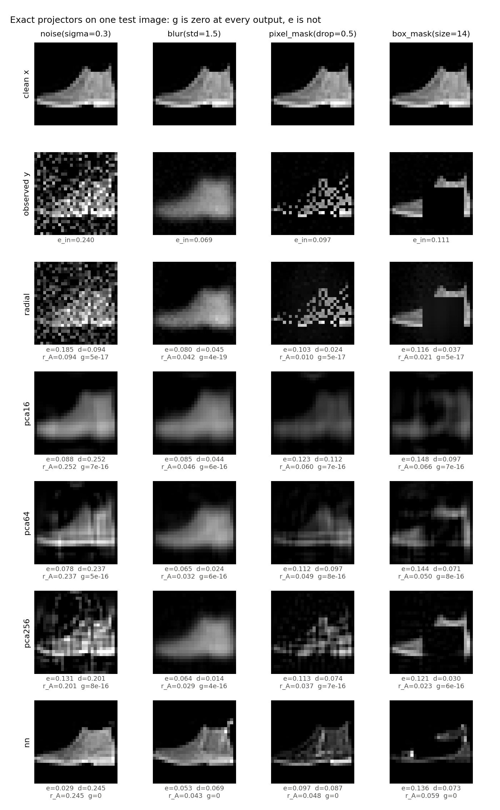
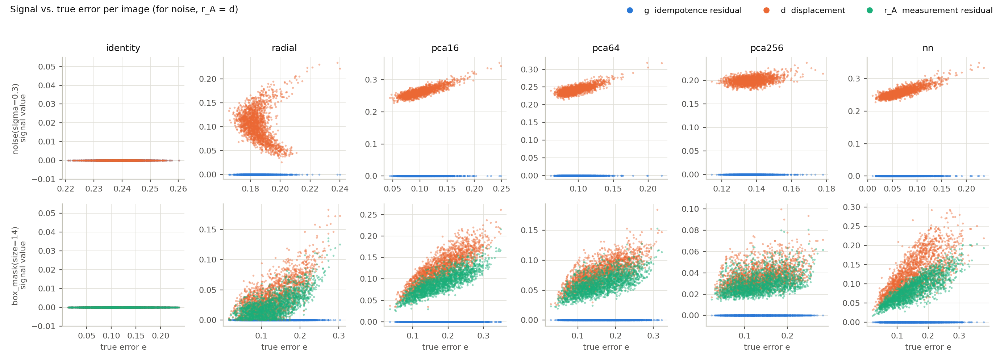
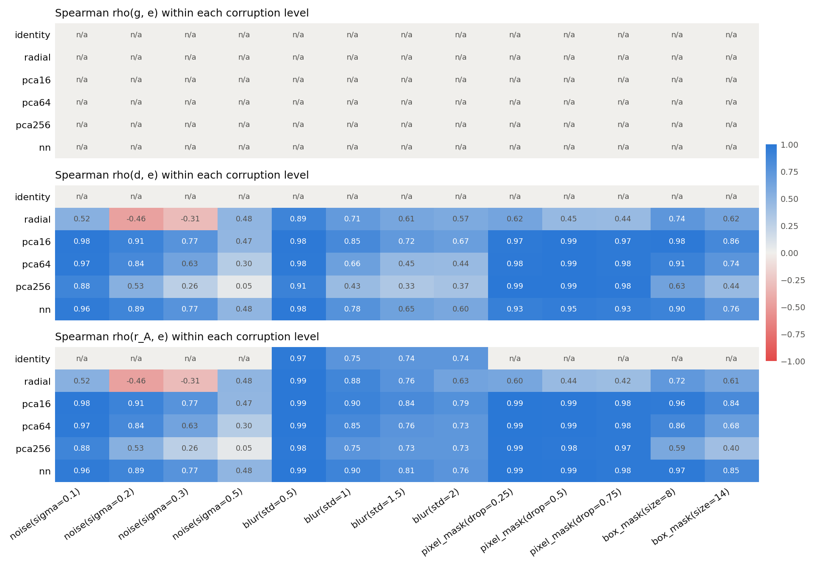
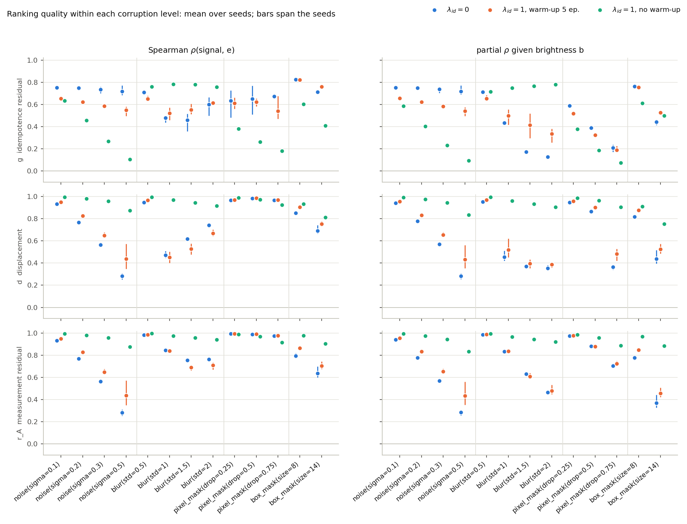
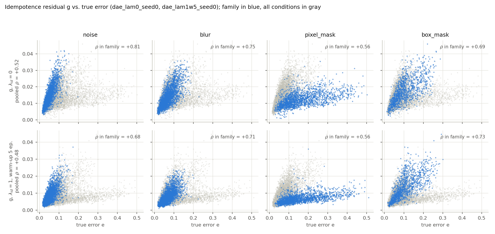
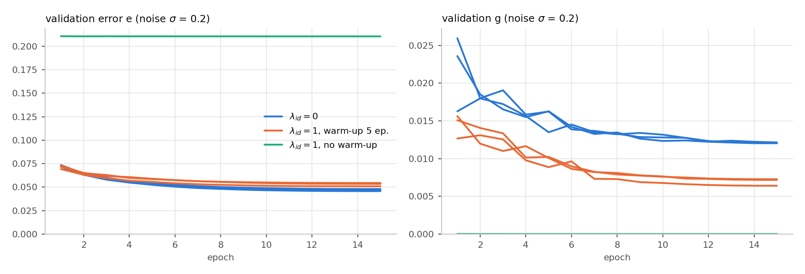
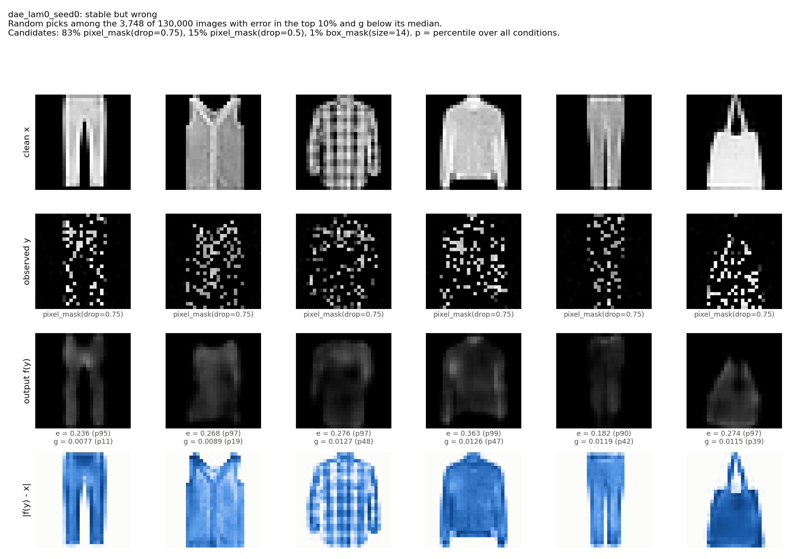

# Fixed-Point Reliability

**Stable but Wrong: Fixed-Point Residuals as Reference-Free Reliability Signals for Image Restoration**
Final project, Modern Computer Vision (MCV), 2026. Proposed as "Calibrating Reference-Free
Reliability Signals for Learned Image Projectors".
Itay Shorian, Michael Bazkor, Boaz Cohen, Bar Milman, Assaf Fleischer.

## Question

Idempotent Generative Networks (IGN) and their follow-ups train maps with
$f(f(y)) \approx f(y)$. A tempting reading is that an output that is a fixed point
is also a correct reconstruction. We test whether this holds, and whether other
signals computed without the clean image are better per-image warnings.

Setting: clean image $x$, known operator $A_s$, observation $y = A_s x + n$.
All signals are per-image mean absolute values over pixels.

| Signal | Definition | Needs |
|---|---|---|
| idempotence residual | $g(y) = \lvert f(f(y)) - f(y) \rvert$ | $f, y$ |
| deeper iterates | $g_k(y) = \lvert f^{k+1}(y) - f^k(y) \rvert$, $q = g_2/g_1$ | $f, y$ |
| displacement | $d(y) = \lvert f(y) - y \rvert$ | $f, y$ |
| measurement residual | $r_A(y) = \lvert A_s f(y) - y \rvert$ | $f, y, A_s$ |
| ensemble disagreement | $\mathrm{dis}(y) = \frac{1}{M}\sum_i \lvert f_i(y) - \bar f(y) \rvert$ | $f_1..f_M, y$ |
| true error (offline only) | $e(y) = \lvert f(y) - x \rvert$ | clean $x$ |

A signal is scored by Spearman's $\rho$ with $e$ and by AUROC for detecting the
worst-error quartile, with image-level bootstrap 95% CIs. It is also turned into a split
conformal upper bound on $e$ (coverage and width, marginally and per corruption family) and
into a risk-coverage curve. See [IMPROVEMENTS.md](IMPROVEMENTS.md) for what those added.

## Setup

Python 3.10+ (tested with Python 3.13, PyTorch 2.12, NumPy 2.4, pandas 3.0 and scikit-learn
1.8). Install PyTorch for your platform first (https://pytorch.org), then:

```bash
pip install -e ".[dev]"
pytest
```

PyTorch older than 2.4 needs `numpy<2`; otherwise every tensor-to-numpy conversion fails with
"Numpy is not available". Fashion-MNIST is downloaded to `data/` on first use.

The 23 trained checkpoints are in `checkpoints/`, so step 2 below is optional. The evaluation
(step 3) writes large per-image dumps, git-ignored, that every later analysis reads.

## Reproduce

### 1. Smoke check on exact projectors (proposal, Sec. 5)

```bash
python scripts/smoke_projectors.py                              # full run, ~22 min
python scripts/smoke_projectors.py --n-eval 2000 --n-boot 200   # quick run, ~2 min
```

Projectors: `radial` (projection onto the sphere of mean training radius around the
training mean) and `pca{16,64,256}` (orthogonal projection onto the top-k principal
subspace), as in the proposal, plus two references: `identity` and `nn` (nearest
training image). Corruptions: Gaussian noise, Gaussian blur, random pixel masks and
random box masks, 13 levels in total, on the 10,000 Fashion-MNIST test images.

Outputs in `results/smoke_projectors/`: `summary.csv` (signal and error means per
condition), `metrics.csv` (Spearman and AUROC with CIs, per condition, pooled per
corruption family, and pooled over everything), figures, and `run_info.json`.

#### Results (10,000 test images, 1,000 bootstrap resamples)

The check reproduces, but it holds by construction. An exact projector satisfies
$P(P(y)) = P(y)$ for every input, so $g$ is zero up to round-off on every image and
every corruption, while the error is not. A constant signal cannot rank images:
$\rho(g, e)$ is undefined and the AUROC is 0.5 everywhere. The hypothesis can only be
tested on learned, approximately idempotent models.

"Within level" is the median [min, max] over the 13 corruption levels; "pooled" mixes
all levels and corruption types.

| projector | max $g$ | mean $e$ | $\rho(d, e)$ within level | $\rho(r_A, e)$ within level | AUROC $d$ / $r_A$ within level | pooled $\rho$ $d$ / $r_A$ |
|---|---|---|---|---|---|---|
| `identity` | 0 | 0.032-0.399 | undefined | +0.75 [+0.74, +0.97] (4/13 defined) | 0.50 / 0.50 | undefined / -0.33 |
| `radial` | 2e-16 | 0.050-0.234 | +0.57 [-0.46, +0.89] | +0.60 [-0.46, +0.99] | 0.84 / 0.86 | +0.57 / +0.38 |
| `pca16` | 2e-15 | 0.092-0.233 | +0.91 [+0.47, +0.99] | +0.91 [+0.47, +0.99] | 0.97 / 0.97 | +0.28 / +0.12 |
| `pca64` | 2e-15 | 0.065-0.231 | +0.84 [+0.30, +0.99] | +0.85 [+0.30, +0.99] | 0.94 / 0.92 | +0.36 / +0.25 |
| `pca256` | 2e-15 | 0.040-0.233 | +0.53 [+0.05, +0.99] | +0.73 [+0.05, +0.99] | 0.80 / 0.84 | +0.57 / +0.50 |
| `nn` | 0 | 0.065-0.236 | +0.89 [+0.48, +0.98] | +0.90 [+0.48, +0.99] | 0.95 / 0.96 | +0.21 / +0.04 |

Observations for the next phase:

1. Displacement and measurement residual rank errors well within a fixed corruption
   level when the fixed-point set is tight (`pca16`, `nn`), and worse when it is loose
   (`pca256`; `identity` gives $d \equiv 0$).
2. A badly shaped fixed-point set can reverse the signal: for `radial`,
   $\rho(d, e) = -0.46$ at noise $\sigma = 0.2$.
3. Rankings weaken as corruption grows: `pca16` under noise goes from $\rho = 0.98$
   ($\sigma = 0.1$) to $0.47$ ($\sigma = 0.5$).
4. Pooling changes the question. Within one corruption family the signals mostly detect
   severity (AUROC = 1.00 for `radial` and `pca256` over the four noise levels). Across
   families the correlations drop to 0.04-0.57, because the scale of $d$ differs between
   noise, blur and masking. Using these signals across corruptions requires calibration.
5. The measurement residual helps where displacement misleads: for blur with `pca256`,
   pooled $\rho(d, e) = -0.41$ but $\rho(r_A, e) = +0.74$.

The full run takes about 22 minutes on a laptop (GTX 1650 Ti), almost all of it in the
bootstrap.







### 2. Train the denoising autoencoders (optional)

Every configuration in the report; run each line with `--seed 0`, `1` and `2` unless noted.

```bash
# bottleneck model (checkpoints dae_*)
python scripts/train_dae.py --lambda-id 0 --seed 0                                    # dae_lam0
python scripts/train_dae.py --lambda-id 0.1 --lambda-warmup 5 --seed 0                # dae_lam0.1w5
python scripts/train_dae.py --lambda-id 1 --lambda-warmup 5 --seed 0                  # dae_lam1w5
python scripts/train_dae.py --lambda-id 1 --lambda-warmup 5 --routing inner --seed 0  # dae_lam1w5_inner
python scripts/train_dae.py --lambda-id 1 --lambda-warmup 5 --routing outer --seed 0  # dae_lam1w5_outer
python scripts/train_dae.py --lambda-id 1 --seed 0                    # dae_lam1, seed 0 only: collapses
# skip-connection model (checkpoints unet_*)
python scripts/train_dae.py --architecture skip --lambda-id 0 --seed 0                    # unet_lam0
python scripts/train_dae.py --architecture skip --lambda-id 1 --lambda-warmup 5 --seed 0  # unet_lam1w5
python scripts/train_dae.py --architecture skip --lambda-id 1 --seed 0    # unet_lam1, seed 0 only: collapses
```

`ConvAutoencoder` (602k parameters, 64-unit bottleneck, no normalization layers) and the skip
model (230k) are trained with $\lvert f(y) - x \rvert_1 + \lambda_{id} L_{idem}$ on Gaussian
noise with $\sigma \sim U[0.05, 0.25]$, for 15 epochs with Adam (learning rate $10^{-3}$, cosine
decay per step, batch 256). The last 5,000 training images are used for validation. At test
time, $\sigma = 0.1, 0.2$ are in distribution, $\sigma = 0.3, 0.5$ are held-out noise levels,
and blur and masks are unseen operators. Checkpoints go to `checkpoints/` and training curves
to `results/train/`. The three `dae_lam0` checkpoints come from an earlier version of the script
that did not record the device; all other runs trained on CPU (`--device cpu`).

With $\lambda_{id} = 1$ from the first step, every seed collapses within one epoch to a
constant output, the per-pixel median image: validation error 0.2107 after one epoch and
0.2106 at epoch 15, equal to that image's, with $g$ about $10^{-6}$. Seed 0 ran all 15 epochs;
seeds 1 and 2 were stopped after two (logs in `results/train/logs/`). `--lambda-warmup 5`
ramps $\lambda_{id}$ from 0 over five epochs and avoids it.

### 3. Evaluate models

```bash
# bottleneck checkpoints (dae_*.pt) plus the radial and pca64 projectors -> results/models (hours)
python scripts/evaluate_models.py --ensemble --device cpu --jobs 4 --threads 2
# skip checkpoints (unet_*.pt), no projectors (a bare --projectors) -> results/models_skip
python scripts/evaluate_models.py --pattern "unet_*.pt" --projectors --ensemble \
    --device cpu --jobs 4 --threads 2 --out results/models_skip
```

In addition to $g$, $d$ and $r_A$, the evaluation computes first-order signals on the
noise levels: the divergence $\mathrm{div} = \tfrac{1}{D}\mathrm{tr}\,J_f(y)$ (Hutchinson
estimate with finite differences), the linearized residual $\lvert J_f(y)(f(y) - y) \rvert$, and
Stein's unbiased risk estimate $\mathrm{SURE} = d_{mse} - \sigma^2 + 2\sigma^2\,\mathrm{div}$.
Signals are scored per corruption level, pooled per family, and pooled over all levels.
Two baselines guard against scores that do not reflect model failures:

- `b`, the mean brightness of $y$. Under masking and strong blur the error grows with the
  amount of content in the image, so brightness alone ranks errors well (Spearman up to
  0.97 within a pixel-mask level). Partial Spearman correlations given $b$ show what each
  signal adds beyond brightness.
- `<signal>@level`, the median of a signal over its corruption level. In pooled scores it
  measures how much of the ranking is severity detection.

`--ensemble` adds the cross-seed disagreement signal; it needs every seed of a group in the same
run, so do not combine it with `--append` for a subset of seeds. `--no-metrics` writes the
per-image dump without the bootstrap scoring. `--from-per-image` scores an existing dump and merges
the scores into `metrics.csv` (only the listed signals with `--signals`). `--append` adds models
to an earlier evaluation in the same folder. The committed dumps got $g_2$, $g_3$, $q$ and dis
from `scripts/add_signals.py`, as recorded in `run_info.json`; a full `--ensemble` evaluation
computes the same columns.

#### Analyses and figures

Minutes each; they read the per-image dumps.

```bash
python scripts/calibrate.py                                                  # results/calibration
python scripts/calibrate.py --results results/models_skip --out results/calibration_skip
python scripts/conformal.py                                                  # results/conformal
python scripts/selective.py                                                  # results/selective
python scripts/checks.py                                                     # results/checks.json
python scripts/report_numbers.py                                             # results/report_numbers.json
python scripts/report_table.py                                               # Tables 1 and 2 of the report
python scripts/plot_models.py --model dae_lam0_seed0                         # results/models/figures
python scripts/plot_models.py --model dae_lam0_seed0 --compact --examples 5  # the report's Fig. 1
python scripts/plot_models.py --model dae_lam1w5_seed0
python scripts/compare_models.py --groups dae_lam0 dae_lam1w5 dae_lam1 --scatter-groups dae_lam0 dae_lam1w5
python scripts/compare_models.py --groups dae_lam0 dae_lam1w5 dae_lam1 --scatter-groups dae_lam0 dae_lam1w5 \
    --scatter-families noise pixel_mask --scatter-name g_vs_error_compact
python scripts/compare_models.py --groups dae_lam1w5 dae_lam1w5_inner dae_lam1w5_outer --out-dir comparison_routing
python scripts/compare_models.py --groups dae_lam0.1w5 dae_lam1w5_inner dae_lam1w5 --out-dir comparison_ablation
python scripts/compare_models.py --results results/models_skip --groups unet_lam0 unet_lam1w5 unet_lam1
```

#### Results

Generated by `scripts/report_table.py` (`results/report_table.csv`, Table 1 of the report).
Spearman $\rho$ with the true error: the median over the 13 levels (or the 4 noise levels) for
each seed, then the mean over three seeds. "partial" controls for brightness; "pooled" and AUROC
mix all levels; "flagged" is the share of the worst-quartile errors under pixel or box masks whose
residual is in its top quartile over all levels (a random score gives 25%).

| model | error | $g$ | $\rho(g,e)$ within | noise | partial | pooled | AUROC | $\rho(d,e)$ | flagged pixel | flagged box |
|---|---|---|---|---|---|---|---|---|---|---|
| bottleneck, $\lambda_{id}=0$ | 0.092 | 0.015 | 0.70 | 0.74 | 0.59 | 0.55 | 0.69 | 0.77 | 18% | 74% |
| bottleneck, $\lambda_{id}=0.1$ | 0.092 | 0.013 | 0.71 | 0.73 | 0.56 | 0.52 | 0.68 | 0.77 | 13% | 76% |
| bottleneck, $\lambda_{id}=1$ | 0.095 | 0.009 | 0.62 | 0.60 | 0.53 | 0.49 | 0.67 | 0.83 | 10% | 89% |
| bottleneck, $\lambda_{id}=1$, inner only | 0.097 | 0.014 | 0.61 | 0.68 | 0.61 | 0.53 | 0.72 | 0.82 | 22% | 89% |
| bottleneck, $\lambda_{id}=1$, outer only | 0.095 | 0.011 | 0.65 | 0.64 | 0.54 | 0.50 | 0.67 | 0.77 | 11% | 79% |
| skip, $\lambda_{id}=0$ | 0.086 | 0.019 | 0.86 | 0.92 | 0.48 | 0.52 | 0.73 | 0.49 | 68% | <1% |
| skip, $\lambda_{id}=1$ | 0.084 | 0.007 | 0.63 | 0.60 | 0.27 | 0.40 | 0.63 | 0.28 | 31% | 2% |

1. **Exact projectors carry no residual information.** The residual is zero for any exact
   projector, whatever the error. A first-order expansion gives
   $g \approx \lvert J_f(y)\,(f(y)-y) \rvert$: the Jacobian removes the displacement, which is
   normal to the fixed-point set. Measured: $g < 2\cdot10^{-15}$, linearized term $\le 10^{-12}$.
2. **Each architecture has a blind spot, and they differ.** The bottleneck model's residual
   flags 18% of its worst pixel-mask errors, fewer than a random score. The skip model's
   residual ranks errors better at 11 of 13 levels, but flags under 1% of its worst box-mask
   errors. In both cases the outputs are stable but wrong under an operator unseen in training.
3. **Training for idempotence makes the residual a worse signal** in both architectures
   (within-level 0.70 to 0.62 and 0.86 to 0.63, no overlap between seeds), and lowers every
   score except the box-mask flagged share, while mean error changes little. $\lambda_{id} = 0.1$
   leaves the within-level $\rho$ unchanged. All three gradient routings lower the within-level
   $\rho$; the outer route alone reproduces the losses in partial and pooled $\rho$ and in the
   pixel-mask flagged share, the inner route alone does not.
4. **Without warm-up both architectures collapse** to constant images: the per-pixel median
   image (validation error 0.2106, the same as that image's) and a black image (0.2885, the mean
   pixel value). At initialization the skip model is far less constant than the bottleneck
   model (output spread $8\cdot10^{-3}$ against $5\cdot10^{-6}$; clean images 0.27), so a start
   as constant as the bottleneck's is not required (`results/checks.json`).
5. **Calibration per level** lifts pooled $\rho$ from 0.00-0.55 to 0.85-0.94, but a predictor
   that returns each level's mean error already reaches 0.73-0.84 (`results/calibration*`).









### 4. Build the report

```bash
cd report && pdflatex main.tex && bibtex main && pdflatex main.tex && pdflatex main.tex
```

## Repository layout

```
src/fpr/
  data.py          Fashion-MNIST loading
  degradations.py  operators A_s: noise, blur, pixel mask, box mask
  projectors.py    exact projectors: identity, radial, PCA, nearest neighbour
  models.py        bottleneck and skip-connection autoencoders, checkpoint loading
  losses.py        reconstruction loss; idempotence loss with inner/outer/both routing
  signals.py       g, g_k, q, d, r_A, the offline error e, first-order signals (div, g_lin)
  ensemble.py      cross-seed disagreement dis
  conformal.py     split conformal bounds, the shift test, SURE self-calibration
  selective.py     risk-coverage curves, AURC, selective risk
  metrics.py       Spearman / AUROC / partial Spearman with clustered bootstrap CIs
  evaluation.py    shared corruption grid, per-image signals, scoring
  plotting.py      shared figure style
scripts/
  smoke_projectors.py  exact-projector experiment
  train_dae.py         training (architecture, lambda_id, warm-up, routing)
  evaluate_models.py   per-image signals and scores (--jobs, --append, --ensemble, --from-per-image)
  add_signals.py       adds g2, g3, q and dis to a stored per-image dump (as done for the results)
  compare_models.py    tables and figures comparing model groups
  plot_models.py       per-model figures, including the stable-but-wrong examples
  calibrate.py         isotonic calibration per level or per family
  conformal.py         coverage and width of conformal error bars
  selective.py         risk-coverage curves and selective risk
  checks.py            collapse, finite-difference accuracy, initialization
  report_table.py      Tables 1 and 2 (results/report_table.csv, report/table_*.tex)
  report_numbers.py    report numbers no other file holds (results/report_numbers.json)
  explore_sure.py      SURE vs. displacement on exact projectors (exploration)
checkpoints/           trained models
report/                LaTeX source and bibliography of the report
tests/                 unit tests (pytest)
results/               result tables and figures (per-image dumps are git-ignored)
```

## Status

- [x] Evaluation pipeline and exact-projector smoke check
- [x] Training and evaluation pipeline for the autoencoders, first-order signals
- [x] Autoencoders for $\lambda_{id} \in \{0, 1\}$, three seeds each, plus the collapsed run
- [x] Evaluation on held-out noise levels, blur and masks, with brightness and severity baselines
- [x] Ablations, three seeds each: IGN-style inner-only routing, outer-only routing,
      $\lambda_{id} = 0.1$
- [x] Skip-connection architecture control: $\lambda_{id} \in \{0, 1\}$, three seeds each, plus
      a collapse run
- [x] Per-level and per-family calibration of the signals
- [x] Split conformal error bars: coverage per family, the calibrate-on-noise shift test, and a
      SURE-self-calibrated variant that needs no clean images
- [x] Risk-coverage curves and selective risk, against an oracle and a random baseline
- [x] Deeper iterates $g_2$, $g_3$, the contraction ratio, and cross-seed ensemble disagreement
- [x] Checks: collapse to the median image, finite-difference accuracy, initialization
- [x] Report (LaTeX, three pages including references) and [IMPROVEMENTS.md](IMPROVEMENTS.md)

## References

1. A. Shocher et al., "Idempotent Generative Network," ICLR 2024.
2. M. Al-Jaff et al., "A Non-Adversarial Approach to Idempotent Generative Modelling," ECAI 2025.
3. S. Zaman et al., "Score-based Idempotent Distillation of Diffusion Models," arXiv:2509.21470, 2025.
4. N. Durasov et al., "IT³: Idempotent Test-Time Training," ICML 2025.
5. A. N. Angelopoulos and S. Bates, "Conformal Prediction: A Gentle Introduction," Foundations and Trends in Machine Learning 16(4), 2023 (arXiv:2107.07511).
6. J. Teneggi, M. Tivnan, J. W. Stayman and J. Sulam, "How to Trust Your Diffusion Model: A Convex Optimization Approach to Conformal Risk Control" (K-RCPS), ICML 2023.
7. J. M. Everink, B. Tamo Amougou and M. Pereyra, "Self-supervised Conformal Prediction for Uncertainty Quantification in Imaging Problems," SSVM 2025 (arXiv:2502.05127).
8. Y. Geifman, G. Uziel and R. El-Yaniv, "Bias-Reduced Uncertainty Estimation for Deep Neural Classifiers," ICLR 2019 (AURC and excess AURC).
9. Y. Xu, W. Guo and Z. Wei, "Selective Conformal Risk Control," arXiv:2512.12844, 2025.
10. K. Hamidieh, V. Thost, W. Gerych, M. Yurochkin and M. Ghassemi, "Complementing Self-Consistency with Cross-Model Disagreement for Uncertainty Quantification," arXiv:2604.17112, 2026.
11. C. M. Stein, "Estimation of the Mean of a Multivariate Normal Distribution," Annals of Statistics 9(6), 1981.
12. S. Ramani, T. Blu and M. Unser, "Monte-Carlo SURE: A Black-Box Optimization of Regularization Parameters for General Denoising Algorithms," IEEE Transactions on Image Processing 17(9), 2008.
13. H. Xiao, K. Rasul and R. Vollgraf, "Fashion-MNIST: a Novel Image Dataset for Benchmarking Machine Learning Algorithms," arXiv:1708.07747, 2017.

## License

MIT, see [LICENSE](LICENSE).
